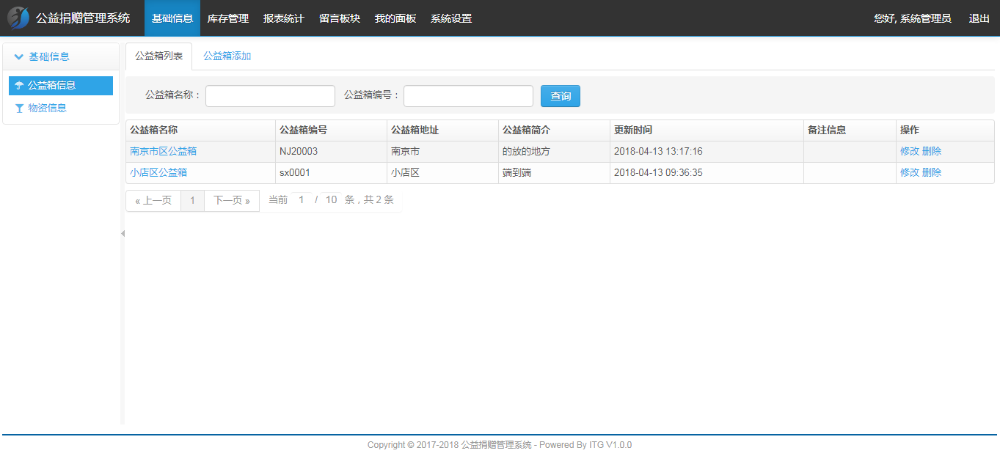
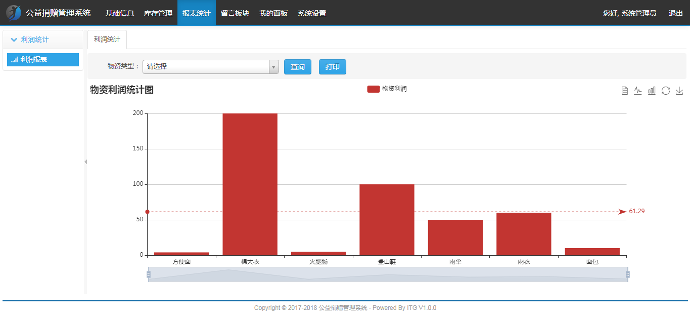
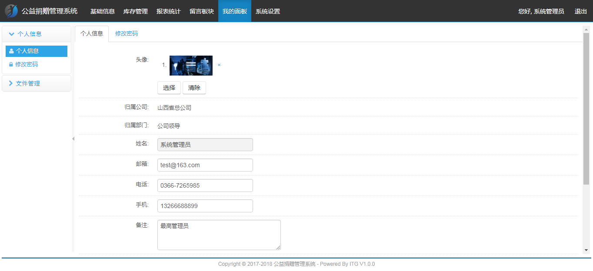
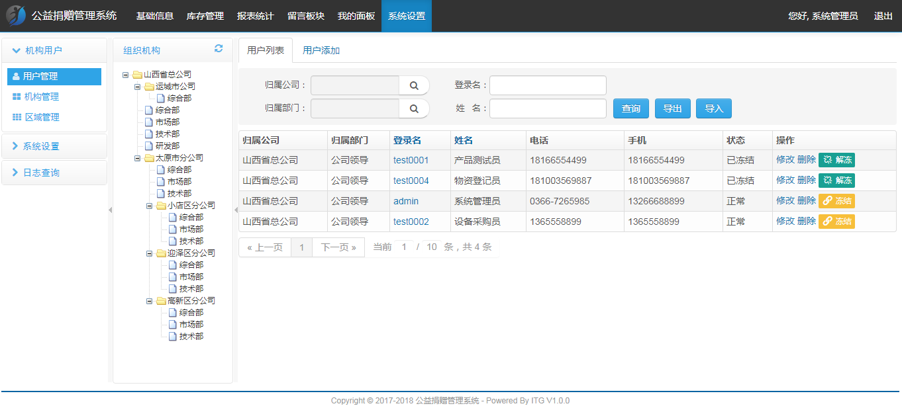
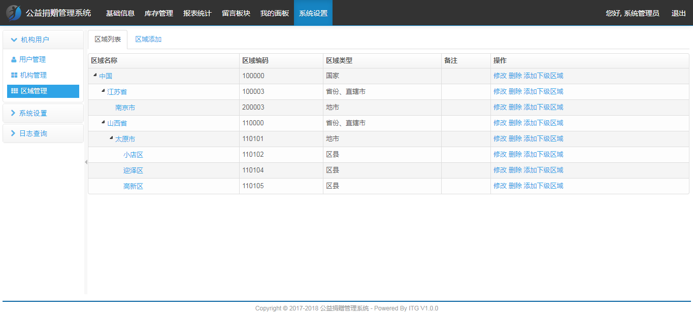
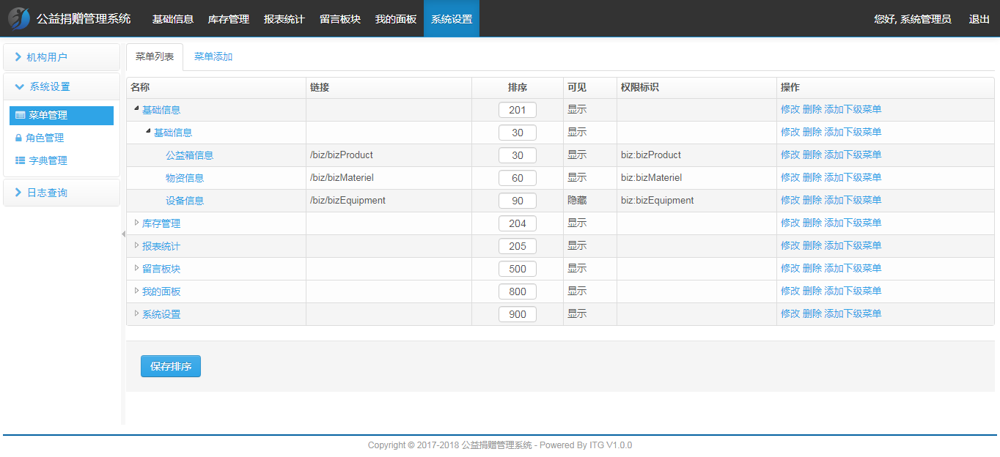
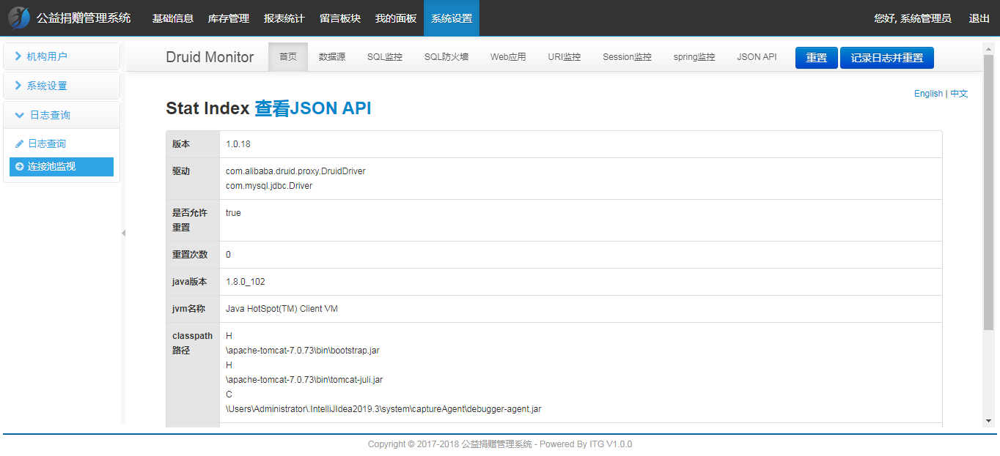

<h1 align="center">公益捐赠管理系统</h1>

## 简介
公益捐赠管理系统：提供管理员和用户角色，具备功能包括公益箱信息管理、区域管理、用户管理、报表统计、菜单管理、连接监视与维护，支持多模块综合管理与用户身份认证。    --计算机毕业设计源码；毕设源码；java毕业设计源码

## 联系方式

<h3 align="center">获取完整代码与数据库文件 + 微信：deepguan QQ: 86050149 QQ群: 783742310</h3>

<h3 align="center">可帮忙远程部署 包运行成功！提供远程部署、修改代码、设计文档指导、代码讲解等服务！</h3>

## 功能介绍（完整见运行截图）
管理员：提供登录、注册功能，以及用户信息管理、区域管理等模块。支持公益箱信息管理，用户可以通过名称或编号查询，并进行修改、删除操作。系统还提供菜单管理，允许编辑和管理不同应用模块。管理员可以查看利润统计，通过物资类型进行查询和打印，提升分析效率。

用户：可以通过登录界面访问系统，管理员具备账号管理与用户信息查询及编辑的权限。此外，支持用户组织结构的展示和个人信息的修改，便于用户自身的信息管理。系统界面简洁，功能划分合理，提升用户体验与工作效率。

技术支持：提供系统技术细节展示，如JVM信息、Classpath路径等，为系统维护和更新提供基础。技术人员可使用连接监视管理，获取系统运维所需的详细信息，同时支持语言设置与日志功能，便于技术问题的排查与系统重置。

## 运行截图

本代码来源于网络,仅供学习参考使用!

